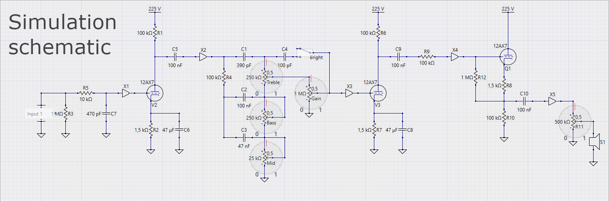

# Alembic F2b

This repository contains schematic and layout for the Alembic F2b preamp.

This project took its inspiration from:
- https://the7line.clan.su/publ/diystompbox/alembic_f2b/2-1-0-58
- https://the7line.clan.su/publ/diystompbox/bass_tube_preamp_alembik_bassman/2-1-0-38.

## Details

All the following section is based on the [Alembic_F2b_bass_preamp_schema.pdf](Alembic_F2b_bass_preamp_schema.pdf) schematic.

Input:
 - 12VDC @ ~310mA
 - ~150mA is used for 12AX7/ECC83 heater

### True bypass

True by using `SW1` footswitch.
R200 and C200 are used to smooth the switch.

### Grid-stopper

`R5` is the grid-stopper along with `C0` the Miller capacitance (R5+C0 forms a low-pass filter that atenuate frequencies greater than ~34KHz).

Resource: http://www.valvewizard.co.uk/gridstopper.html

### Gain stages

First stage is composed `R1`, `C1`, `R3` and `C3`.
Second stage is composed `R2`, `C2`, `R4` and `C9` that can saturate when the Gain's pot is at its maximum.

Resources:
- http://www.valvewizard.co.uk/gainstage.html
- https://www.ampbooks.com/mobile/amplifier-calculators/cathode-capacitor/ for `C1` and `C2`
- http://www.learningaboutelectronics.com/Articles/What-is-a-coupling-capacitor for `C3`, `C9` and `C10`

### Tone stack

Fender like tone stack: `C5`, `C6`, `C7`, `Bass`, `Midrange` and `Treble`.
`C8` is used as bright mod.
`Sweep` is used to move the mid freqs but it also changes the behaviour of bass and treble pots, default is 0% (100KΩ).

Resource: http://www.guitarscience.net/tsc/fender.htm

### Impedance adaptor

#### Input

`R200` is the input impedance for instrument.
`R7` is the grid leak.

#### Output

This part of the schema is juste used to reduce the output impedance.
`R9` and `R10` divides the HT voltage by 2 and put the AC signal provided by `C9` oscillating around 110VDC.
`Q1` is just used as a cathode folower, no amplification is done, we just use the low impedance property of the transistor.

### Heater filtering

`C100`, `L1` and `C101` are used to filter the voltage and current in order to minimize the hum provided by the heater.
If your power supply has a good quality, this part is not needed.

Resource: http://www.valvewizard.co.uk/heater.html

## Tools

- [KiCAD](https://kicad.org)
  - https://gitlab.com/kicad/code/kicad
  - https://github.com/KiCad
- [DIYLC](http://diy-fever.com/software/diylc)
  - https://github.com/bancika/diy-layout-creator

## Resources

- http://www.valvewizard.co.uk/index.html
- https://www.ampbooks.com/mobile/amplifier-calculators
- http://www.guitarscience.net/tsc/info.htm (tonestack calculator)
